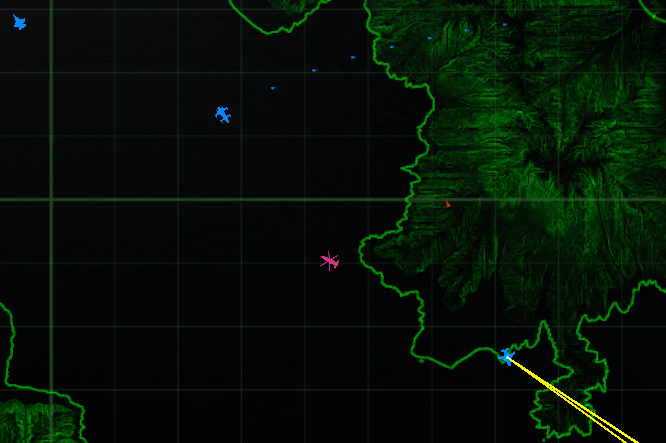

**I am just a hobbyist, not a professional programmer. I'll try my best to make this work well enough, but please set your expectations accordingly. Keep your fingers crossed and peepers peeled for a better mod to come along, or for the function to be added into the vanilla game. Happy flying o7**

# Wingman Visual for Nuclear Option

**A client-side mod that adds simple wing / party-style visual tracking to Nuclear Option.**

## About

This mod adds a lightweight **"wingman" marking system** to Nuclear Option.

When you are **spectating another player** (via the map, while not in an aircraft), you can press **`P`** (default, configurable) to add **or remove** that player from your **Wing**.

Wing members are:
- Highlighted on the **map** using a **distinct color** (separate from standard blue friendly / red enemy markers).
- Easier to locate for **spectating**, **forming up**, or just keeping track of who you're flying with.

The goal is to provide a simple, unobtrusive way to visually group up with other players — especially useful on busy servers or when coordinating flights without full squad mechanics.

Once installed, the mod is **enabled by default**.

## Features

- **Wing / party-style player marking**
  - Add or remove players from your Wing while spectating.
  - Wing members are displayed with a unique map color for easy identification.
- **Configurable keybind**
  - Default key is **`P`**, adjustable via the auto-generated config file.
- **Client-side only**
  - No server installation required.
  - Other players do not need the mod installed.

## Known Limitations

- **Players only (intended)**
  - This mod is designed to mark **players**, not AI units.
- **NPC edge case**
  - If you add an NPC unit to the Wing, **all units of the same vehicle type** will be highlighted.
  - This is a known problem and not the intended use.

## Requirements

- [Nuclear Option](https://store.steampowered.com/app/2168680/Nuclear_Option/) (Steam)
- [BepInEx](https://github.com/BepInEx/BepInEx/releases) (Latest pack for Unity Mono games — usually just drop the `BepInEx` folder into your game directory)

## Installation

1. Install **BepInEx** if you haven't already:
   - Download the appropriate pack from the [BepInEx GitHub releases](https://github.com/BepInEx/BepInEx/releases).
   - Extract it so the `BepInEx` folder is directly inside your Nuclear Option install directory  
     (e.g. `C:\Program Files (x86)\Steam\steamapps\common\Nuclear Option\`).
   - Launch the game once — BepInEx will generate its folders.

2. Download the latest release of **Wingman Visual** from the [Releases page](https://github.com/YourGitHubUsername/WingmanVisual/releases).

3. Extract the contents of the zip file into the `BepInEx/plugins` folder.

## Disclaimer

> I am **not responsible** for kicks, bans, or penalties on public servers.  
> **Always check each server’s rules** before playing. Use online **at your own risk**.
